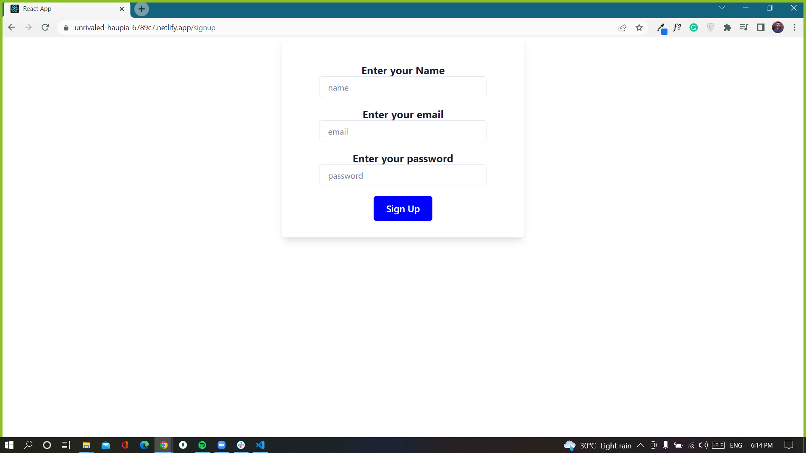
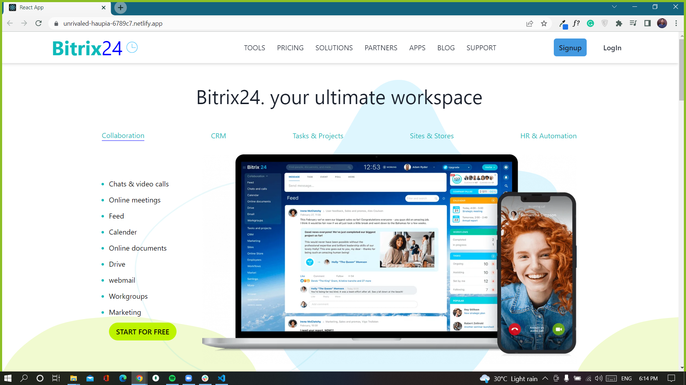
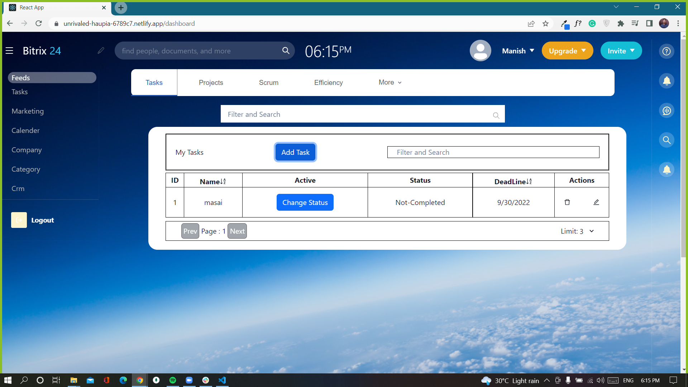
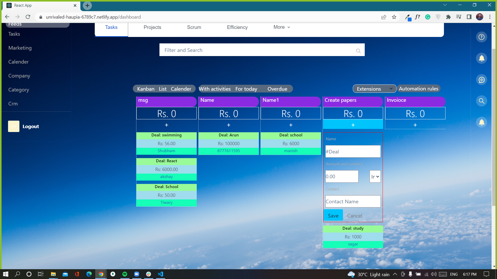
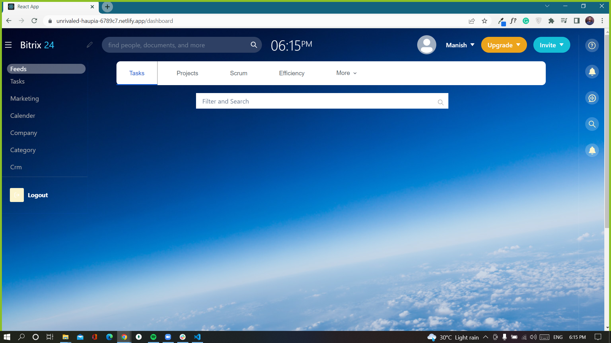

# BITRIX

Bitrix24 is a workspace to do chats&video calls, online meeting. Task can be created for project.

# BITRIX CLone

This is the clone of BITRIX website which we have done during our Unit 5 construct week at Masai. Its functional clone of the website.

## Technologies used

- HTML
- Javascript
- CSS
- React
- Redux
- Chakra UI
- Json Server
- MONGODB
- NODE JS

## Functional things

- User signup page and login page with form validation and data managed with mongoDB.
- Home page
- CRM page with data managed with json server.
- In CRM we can add tasks with labels.
- Sorting and Filtering functionality
- Cart Page with size & quantity updation
- Checkout page
- Payment page with payment confirmation

## Run Locally

Pre-Requisite :
VS Code

Clone the project

```bash
#   https://github.com/Aaru1996/gusty-cover-2254
#   run json server on local host on port 8000 for CRM page data.
#   For other pages datas are on mongoDB.
```

## Website Flow

- Signup page by Arun Yadav
  

- Home page by Sagar Gondage
  

- Task page by Sagar Gondage
  

- Crm page by Manish Singh
  

- Dashboard page by Manish Singh
  

## Authors

- [Manish Singh](https://github.com/ManishSingh64)
- [Sagar Gondage](https://github.com/Sagar-Gondage)
- [Arun Yadav](https://github.com/Aaru1996)
